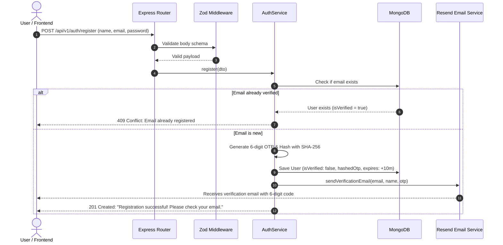
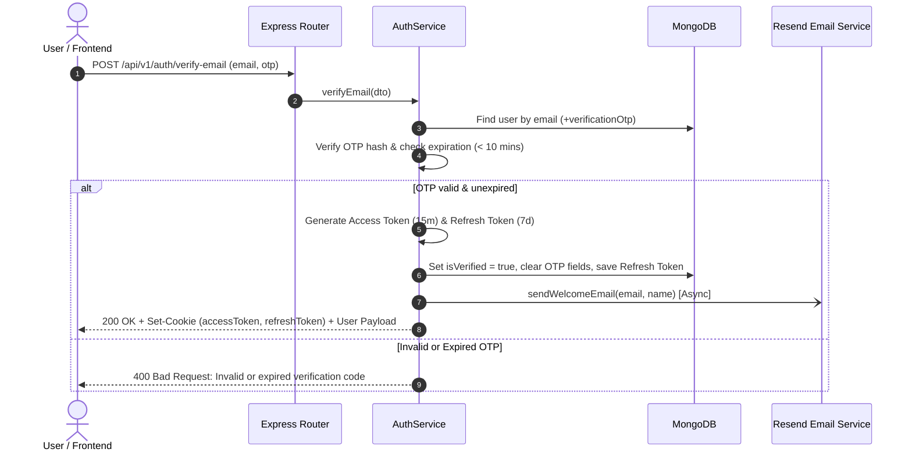
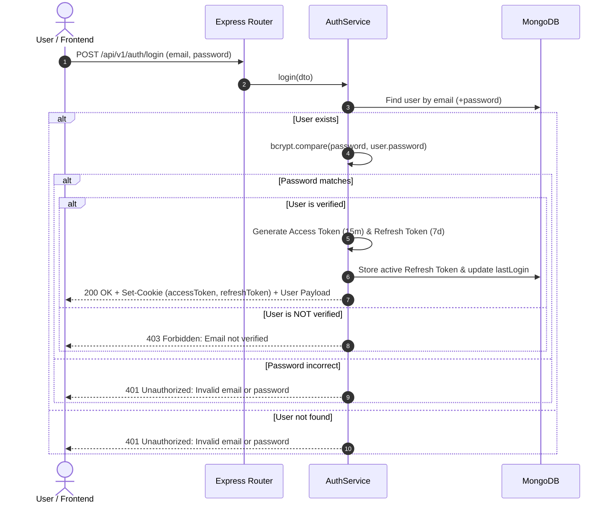
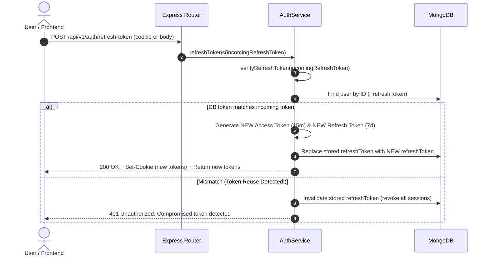
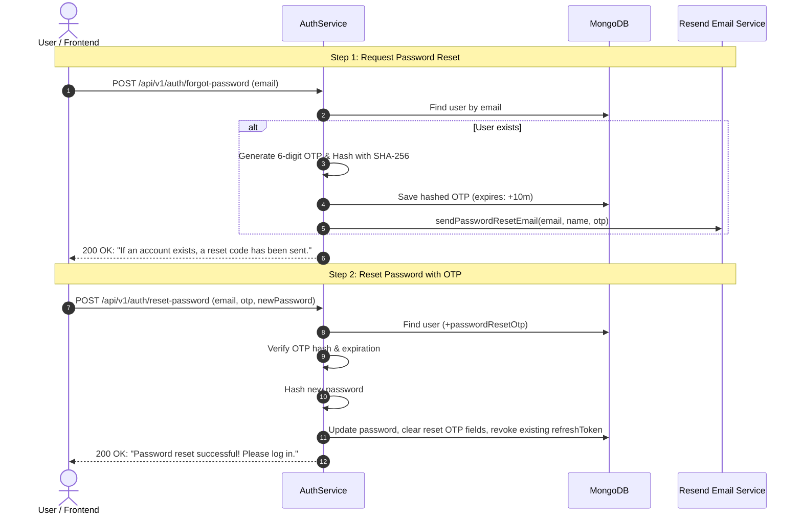
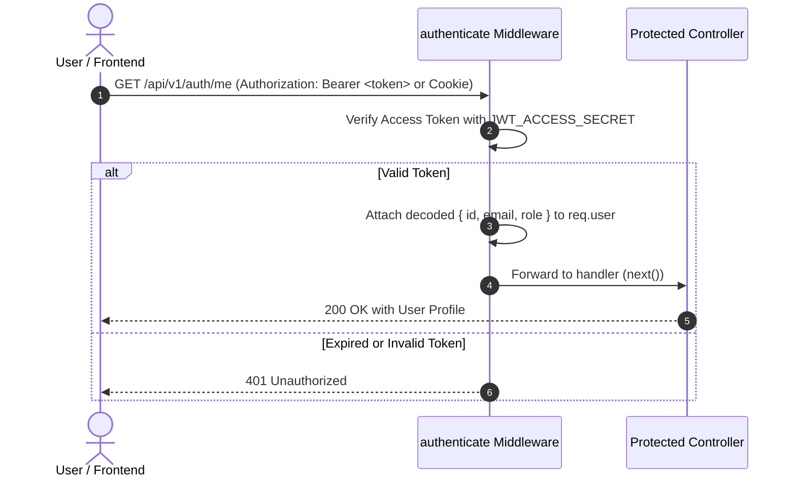

# 04 - Authentication Flows & Lifecycle Architecture

This document diagrams the authentication workflows, security measures, and token rotation mechanics implemented in the Dicey backend.

---

## 1. 📝 User Registration & Email Verification Flow

---

## 2. ✅ Email OTP Verification Flow

---

## 3. 🔑 User Login Flow

---

## 4. 🔄 Token Refresh Flow (Token Rotation & Reuse Detection)

---

## 5. 🔓 Password Reset Flow

---

## 6. 🛡️ Protected Route Access Flow

