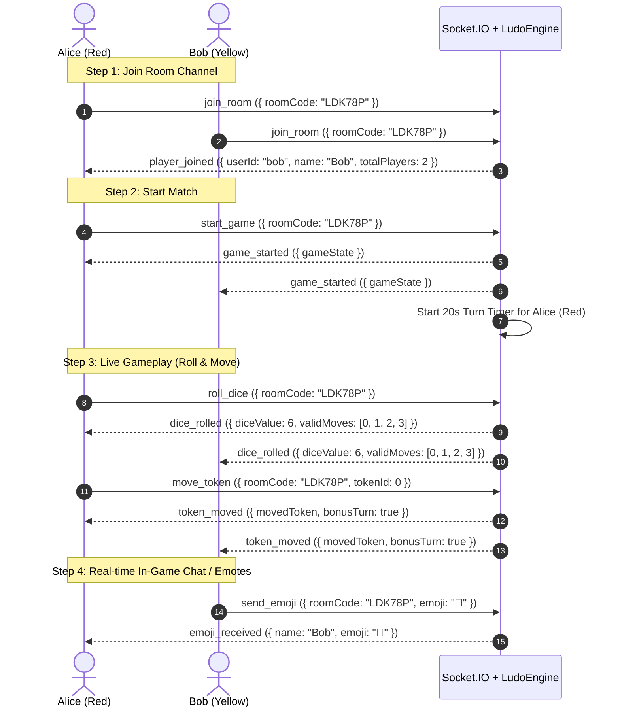

# 06 - Real-time Multiplayer (Socket.IO) Architecture

**WebSocket URL**: `ws://localhost:5000`

Dicey uses **Socket.IO** over WebSockets for bidirectional, ultra-low-latency (<30ms) multiplayer communication, authoritative turn timers, and live in-game interactions.

---

## 🔐 1. Socket Authentication Handshake

Every client attempting a WebSocket connection must provide a valid JWT access token during the initial connection handshake.

### Client-side Connection Example (JavaScript / React / React Native):
```javascript
import { io } from 'socket.io-client';

const socket = io('http://localhost:5000', {
  auth: {
    token: 'eyJhbGciOi...', // JWT Access Token from login/register
  },
  transports: ['websocket', 'polling'],
  withCredentials: true,
});

socket.on('connect', () => {
  console.log('Connected to Dicey Realtime Server! Socket ID:', socket.id);
});

socket.on('connect_error', (err) => {
  console.error('Socket authentication failed:', err.message);
});
```

*Upon successful connection, the backend automatically marks `Account.isOnline = true` in MongoDB.*

---

## 📡 2. Real-time Event Specification

### 📤 Client-to-Server Events

| Event Name | Payload | Description |
| :--- | :--- | :--- |
| **`join_room`** | `{ roomCode: string }` | Joins the specified game room channel (`socket.join(roomCode)`). |
| **`start_game`**| `{ roomCode: string }` | Room creator triggers match start. Initializes board and starts turn timer. |
| **`roll_dice`** | `{ roomCode: string }` | Current player rolls dice. Broadcasts roll to all players and starts token selection timer. |
| **`move_token`**| `{ roomCode: string, tokenId: number }` | Moves token `0`, `1`, `2`, or `3`. Broadcasts move, handles captures, and advances turn. |
| **`send_emoji`**| `{ roomCode: string, emoji: string }` | Broadcasts real-time emote/reaction (e.g. `"😂"`, `"🔥"`) to all room players. |
| **`leave_room`**| `{ roomCode: string }` | Leaves lobby or forfeits active game. |
| **`find_match`**| `{ maxPlayers: 2 \| 4 }` | Enters random matchmaking queue for 1v1 (2P) or 4-player online matches. |
| **`cancel_matchmaking`** | — | Cancels active matchmaking search. |

---

### 📥 Server-to-Client Events

| Event Name | Payload | Description |
| :--- | :--- | :--- |
| **`matchmaking_searching`** | `{ maxPlayers, queueSize }` | Emitted when successfully queued up searching for random opponents. |
| **`match_found`** | `{ roomCode, color, gameState }` | Broadcasts when opponents are matched and live game room is created. |
| **`matchmaking_cancelled`** | — | Confirms matchmaking search cancellation. |
| **`player_joined`** | `{ userId, name, totalPlayers }` | Emitted when a new player joins the room lobby. |
| **`player_left`** | `{ userId, name }` | Emitted when a player leaves or disconnects. |
| **`game_started`** | `{ gameState }` | Broadcasts when the match starts with full initial board coordinates. |
| **`dice_rolled`** | `{ userId, rollResult, gameState }` | Broadcasts rolled dice value, valid movable token IDs, and consecutive sixes. |
| **`token_moved`** | `{ userId, moveResult, gameState }` | Broadcasts updated token coordinates, capture info (katti), and bonus turn status. |
| **`turn_timeout`** | `{ userId, message, gameState }` | Emitted when a player exceeds the 20s timer and the server executes auto-play. |
| **`emoji_received`**| `{ userId, name, emoji }` | Displays opponent reaction on screen. |
| **`game_finished`**| `{ winners, gameState }` | Broadcasts final match rankings (`rank: 1`, `rank: 2`...) and victory screen. |
| **`error_event`** | `{ message: string }` | Emitted on invalid actions (e.g. playing out of turn, invalid token). |

---

## ⏱️ 3. Turn Timer & AFK Auto-Play (20-Second Engine)

To guarantee matches never get stuck if a player goes offline or locks their phone:
1. **Timer Initialization**: When a player's turn begins, the server starts a **20-second countdown**.
2. **Auto-Play Execution**:
   - If player hasn't rolled within 20s:
     - Server **auto-rolls** the dice.
     - If legal moves exist, server **auto-plays** the first valid token.
     - If no legal moves exist, server **passes the turn** to the next player.
   - If player rolled but didn't pick a token within 20s:
     - Server **auto-plays** the first valid token.
3. **Turn Reset**: As soon as a legal move is completed, the timer resets for the next player.

---

## 🔄 4. Real-time Flow Diagram (Play With Friends)



---

## 📲 5. Live Friend Game Invite Workflow

When waiting in a game lobby, players can send a live game invite popup to any online friend:

1. **Send Invite**:
   ```javascript
   socket.emit('invite_friend', {
     friendId: '673f8a421b8c091f9b3a1a9e',
     roomCode: 'LDK78P',
   });
   ```
2. **Receiver Gets Real-time Popup**:
   ```javascript
   socket.on('game_invite_received', ({ fromUserId, fromName, roomCode, gameMode, maxPlayers }) => {
     // Render modal on receiver's screen:
     // "Alex Mercer invited you to a Quick Ludo match! [Join] [Decline]"
   });
   ```
3. **Accepting or Declining**:
   - To Accept: Client calls `socket.emit('join_room', { roomCode })`.
   - To Decline: Client calls `socket.emit('decline_invite', { roomCode, fromUserId })`.

---

## ⚡ 6. Game Modes: Classic vs Quick Mode

| Mode | Tokens Required to Win | Estimated Match Time | Recommended Use Case |
| :--- | :--- | :--- | :--- |
| **`CLASSIC`** | **4 Tokens** in Home | 15 - 25 minutes | Traditional, full-length multiplayer matches. |
| **`QUICK`** | **1 Token** in Home | 3 - 5 minutes | Fast-paced, competitive quick gaming sessions. |

*Configurable when creating rooms (`POST /api/v1/ludo/rooms { "gameMode": "QUICK" }`) and visible in matchmaking.*

---

## 🤖 7. Smart AI Bot Fallback System

To ensure human players never wait indefinitely in matchmaking queues:
1. **15-Second Queue Timer**: When a player clicks *"Find Match"*, the server searches for human opponents.
2. **Automated Bot Spawning**: If 15 seconds elapse without enough human players, the server automatically spawns intelligent AI Bots (`Bot Alex`, `Bot Priya`, etc.) to fill remaining slots.
3. **Bot Decision Engine (`LudoBot`)**:
   - Evaluates all legal moves using a weighted heuristic:
     1. **Opponent Capture (Katti)**: Highest priority (+1000 weight)
     2. **Reaching Home**: High priority (+500 weight)
     3. **Entering Safe Corridor**: (+300 weight)
     4. **Safe/Star Squares**: (+250 weight)
     5. **Unlocking Base**: (+200 weight)
     6. **Escaping Threat**: Moves tokens that have opponents directly behind them (+150 weight)
   - Simulates natural human reaction times (1.2s roll delay, 800ms move delay) so the gameplay feels authentic.

